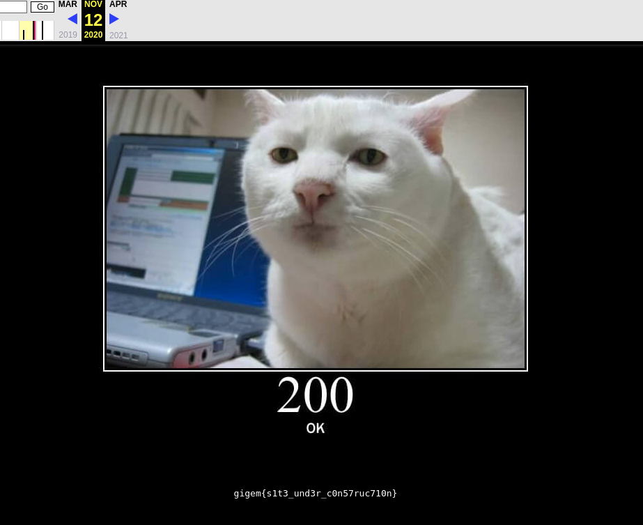
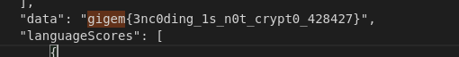
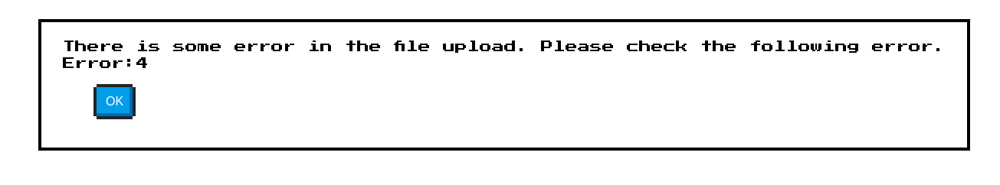
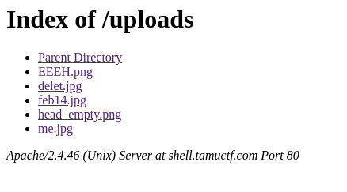
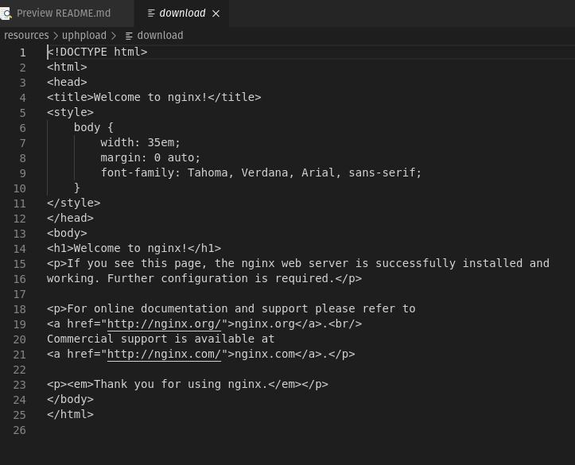
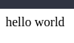

# CTF Recap -- TAMUctf 2021
********************************
## Info: 
Headers will be formatted by `Challenge Name - Points: PointValue`
All flags in this ctf were formatted with gigem{flag_value_here}
Waited until after ctf was finished to upload this. 
**If you're here for the bonus credit reasons, see [uphpload](#uphpload---points-100) to save time**
## Archival - Points: 50
**Challenge**:
> I can't remember the flag... it used to be on our website but when we updated it the flag got lost in the process. Since nothing ever gets deleted on the internet it should be safe, but how?

**Solution**: 
Going to the [wayback machine for the site](https://web.archive.org/web/20201112013748/https://tamuctf.com/) has the flag that was present on the site during development. 

## Encoding - Points: 100
**Challenge**:
> This is literally the flag but obfuscated through tons of different encoding schemes. [data.txt](resources/encoding/data.txt)

**Solution**:
Went to [CyberChef](https://gchq.github.io/CyberChef/) and ran magic on the file with a depth of 6. After waiting it gave the following output [download.dat](resources/encoding/download.dat)

Searching for the `gigem{` string showed that the flag was found

## uphpload - Points: 100 
**Challenge:**
> I made a website to collect reaction images, feel free to upload some! *instanced-url-removed*

**Recon/Discovery**
The website appeared as below:

Trying to click the upload without a file resulted in the following error popup 

The uploaded files button led to the following page:

Each of the images were just anime reaction images. Such as

Parent Directory led back to the following page source code: [source](resources/uphpload/download) 

nginx is a server instance manager, so I'm going to likely say that attacking this structure isn't allowed due to the underlying server structure of the ctf being considered out of play.

**Solution:**
From this (and the hint in the title of the challenge), I gathered there may be a way to upload a php file to the server and have it execute server-side. So, I tried uploading the following file: [wow.php](resources/uphpload/wow.php) and was greeted by the following screen:  

To attempt to overcome this, I changed the file extension of `wow.php` to [wow.jpg](resources/uphpload/wow.jpg) and was greeted with 

Going to the uploads and going to our new upload and opening the file we see... this... 
Not what we're going for, really was hoping to see hello world. So, time to try some other tricks

[wow.php.jpg](resources/uphpload/wow.php.jpg) fails to upload.
[test.php](resouces/../resources/uphpload/test.php) fails to upload as well. (Same file as wow.php but with a gif header value falling before the php payload)

It then dawned that maybe the check was not checking the last segment after splitting the string on .'s, but rather checking that the second portion of the split was within the whitelist. For example, if the white list was {A,B,C}, cat.X.B would fail, but cat.B.X would pass. So, then came [wow.jpg.php](resources/uphpload/wow.jpg.php). The upload succeeded, which was promissing. And then, finally there was code execution

Thus began the attempt to find the flag. Uploaded [dead.jpg.php](resources/uphpload/dead.jpg.php), which allows me to specify a command using `?cmd=` when accessing the file through the uploads directory.

To locate the flag, I used `dead.jpg.php?cmd=cd%20/;ls` which luckilly gave the following output: 
> bin dev etc flag_is_here home lib media mnt opt proc root run sbin srv start.sh sys tmp usr var

No search needed the flag is in `flag_is_here`

I then used `/dead.jpg.php?cmd=cd%20/;ls%20flag_is_here` to find the file with the flag and saw the only file in the directory was
> text.txt

(I didn't know for certain that it was a directory, but worst case scenario is it only shows the extensionless flag_is_here file if it was a file rather than a directory)

Using `/dead.jpg.php?cmd=cat%20/flag_is_here/flag.txt` I retrieved the flag.

